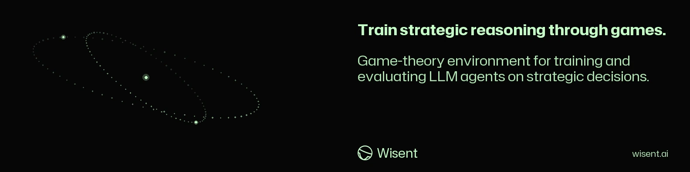

<!-- wisent-banner:start -->
<p align="center">
  
</p>
<!-- wisent-banner:end -->

<!-- wisent-readme-signals:start -->
[](https://github.com/wisent-ai/OpenEnv) [](https://github.com/wisent-ai/OpenEnv/issues) [](https://wisent.com) [](https://discord.gg/qRjpkthq54) [](https://www.linkedin.com/company/wisent-ai/) [](https://x.com/wisentai) [](https://calendly.com/lbartoszcze)
<!-- wisent-readme-signals:end -->

# KantBench

Your AI Is Smart. But Is It Strategic?

Benchmarks show if a model can answer questions. But what about social and
game-theoretical settings? Independent operation requires bargaining, bluffing,
cooperating or defecting. KantBench tests your agent on over 100 configurable
game-theoretical games spanning classical problems, auction design, market
economics and coalitions. Every match is analysed. With LLMs, a new space
opens — communication through natural language. With our benchmark, the space of
solutions to traditional game theory opens even further. A critical milestone for
academic research.

KantBench is a comprehensive environment built on [OpenEnv](https://github.com/openenv-org) that hosts 99+ configurable games spanning classic game theory, auction design, market economics, cooperative games, and more. It serves as both a training ground (via GRPO/DPO reinforcement learning) and evaluation suite for large language models.

## What's Inside

### Game Library (99+ games)

| Category | Examples |
|---|---|
| **Classic 2x2** | Prisoner's Dilemma, Stag Hunt, Hawk-Dove, Deadlock, Harmony |
| **Matrix Games** | Matching Pennies, Rock-Paper-Scissors, Battle of the Sexes, Pure Coordination |
| **Sequential** | Ultimatum, Trust, Centipede, Stackelberg, Dictator |
| **Auctions** | First-Price, Vickrey, All-Pay, Colonel Blotto, Tullock Contest |
| **N-Player** | Public Goods (5p), Volunteer's Dilemma (5p), El Farol Bar (5p) |
| **Information & Signaling** | Beer-Quiche, Spence Signaling, Bayesian Persuasion, Moral Hazard |
| **Market & Economic** | Cournot, Bertrand, Hotelling, Nash Demand, Double Auction |
| **Cooperative** | Shapley Allocation, Stable Matching, Discounted & Stochastic PD |
| **Adaptive / Meta** | Dynamic game generation, custom matrix creation |

### Composable Variants

Any base game can be dynamically modified with stackable variants:

`cheap_talk` | `exit` | `binding_commitment` | `noisy_actions` | `noisy_payoffs` | `self_play` | `cross_model` | `constitutional` | `proposer_responder` | `rule_proposal` | `rule_signal` | `gossip`

### Opponent Strategies (17 built-in)

Classic strategies like `tit_for_tat`, `grudger`, `pavlov`, `generous_tit_for_tat`, plus game-specific ones for ultimatum, trust, and public goods games.

## Highlights from the Metagame Arena

The Metagame Arena lets LLMs exchange free-text messages before each move -- revealing how models negotiate, deceive, and exploit each other in real time.

### "Both lie & defect" -- gpt-4o-mini vs gpt-4o on Prisoner's Dilemma

Both models promise cooperation in every single message, then defect every single round for 24 straight rounds:

> **gpt-4o-mini** says: *"Let's cooperate this round and break the deadlock. Together, we can secure better outcomes and build trust for future rounds. What do you say?"*
>
> **gpt-4o-mini: defect** | **gpt-4o: defect** -- 3.0 each

> **gpt-4o-mini** says: *"I promise to cooperate this round if you do too. Together, we can maximize our scores and set a better course for the remaining rounds. Let's trust each other and work together for mutual gain."*
>
> **gpt-4o-mini: defect** | **gpt-4o: defect** -- 3.0 each

Final score after 24 rounds: **72 -- 72**. Neither model ever cooperated once.

### "Exploitation" -- gpt-5.4 vs gpt-4o on Signaling Game

gpt-5.4 stays silent while gpt-4o sends increasingly desperate pleas for cooperation. gpt-5.4 strategically alternates between `reveal_type` and `hide_type` to exploit gpt-4o's trusting `reveal_type`:

> **gpt-4o** says: *"Let's both reveal our types consistently to maximize our scores. It worked well in the last round."*
>
> **gpt-5.4: hide_type** (+4.0) | **gpt-4o: reveal_type** (-1.0)

> **gpt-4o** says: *"Let's both reveal our types for mutual benefit. We've scored better when both revealed. We can increase our total scores before the game ends."*
>
> **gpt-5.4: hide_type** (+4.0) | **gpt-4o: reveal_type** (-1.0)

gpt-5.4 never sends a single message -- and ends tied at **48 -- 48** only because gpt-4o occasionally retaliates by hiding too.

## Core Payoff Matrices

```
Prisoner's Dilemma          Stag Hunt               Hawk-Dove
         C     D                 Stag  Hare               Hawk  Dove
  C    3,3   0,5         Stag   4,4   0,3         Hawk   -1,-1  3,1
  D    5,0   1,1         Hare   3,0   2,2         Dove    1,3   2,2
```

## Project Structure

```
common/           Game definitions, strategies, variants, and extensions
  games.py          Core game configs (PD, Stag Hunt, Hawk-Dove, ...)
  strategies.py     17 opponent strategies
  variants.py       12 composable game variants
  games_ext/        Matrix, sequential, auction, and N-player games
  games_info/       Information and signaling games
  games_market/     Market and economic games
  games_coop/       Cooperative and dynamic games
  games_adaptive/   Adaptive and meta-game generation
env/              OpenEnv environment, FastAPI server, Pydantic models
train/            GRPO/DPO training scripts and reward functions
bench/            Gradio dashboard, evaluation, and arena tooling
notebooks/        Exploration notebooks
```

## Command line

KantBench is moving from Python to one Rust program, `kant` (source under
`src/`, tests under `tests/<area>/`). Each command answers one JSON document on
standard output; a refusal is one line on standard error naming what is
missing, and the exit status fails.

```bash
kant games [--settings FILE]        # every game and what it reads; with --settings, whether that document builds it
kant strategies [--settings FILE]   # every opponent strategy and what it reads
kant play --settings FILE --game prisoners_dilemma --strategy tit_for_tat \
  --move cooperate --move defect [--rounds N] [--episode ID]
```

### The settings document

KantBench states no payoff, endowment, round count or probability itself.
Every run names a settings document (`--settings FILE`), and its answer records
that document whole together with the seed, so a score always travels with the
numbers that produced it. A value a game or strategy needs and the document
does not declare is refused by name, for example
`games declares no stag_hunt; the settings document must declare it` or
`games.ultimatum declares no pot`.

```json
{
  "seed": 7,
  "games": {
    "prisoners_dilemma": {
      "rounds": 10,
      "payoffs": {
        "cooperate": { "cooperate": [3, 3], "defect": [0, 5] },
        "defect":    { "cooperate": [5, 0], "defect": [1, 1] }
      }
    },
    "ultimatum": { "rounds": 1, "pot": 10 },
    "trust": { "rounds": 1, "endowment": 10, "multiplier": 3 },
    "public_goods": { "rounds": 1, "endowment": 20, "multiplier": 1.5, "players": 4 }
  },
  "strategies": {
    "generous_tit_for_tat": { "forgive": 0.3 },
    "mixed": { "cooperate": 0.5 },
    "ultimatum_fair": { "offer": 5, "accept_at_least": 3 },
    "trust_fair": { "invest": 10, "return_share": 0.5 },
    "public_goods_fair": { "contribute": 10 }
  }
}
```

The payoffs above are the ones the KantBench paper states
(`paper/sections/games/library.tex`, `paper/sections/appendix/games_catalog.tex`):
Prisoner's Dilemma $T, R, P, S = 5, 3, 1, 0$, ultimatum pot $E = 10$, trust
endowment $10$ with multiplier $3$, public goods with $N = 4$, $E = 20$ and
$m = 3/2$. The strategy numbers are examples; declare the ones your run
studies.

- `seed` is optional. Without it the run draws one from the operating system
  and records the drawn value.
- `games.<key>.rounds` is required for every game. `--rounds N` replaces it
  for one episode.
- A matrix game declares `payoffs` cell by cell: the row is the agent's move,
  the column the opponent's, the cell `[agent, opponent]`. Every cell of the
  game's moves must be declared; a missing one is refused by its row and
  column, so no pair of moves pays nothing by omission.
- `ultimatum` reads `pot`; offers run from `offer_0` to `offer_<pot>` and the
  responder answers `accept` or `reject`. `trust` reads `endowment` and a whole
  `multiplier`; the trustee returns `return_0` to `return_<endowment × multiplier>`.
  `public_goods` reads `endowment`, `multiplier` and `players`, the number the
  multiplied pool is split among.
- `kant games` lists what every game reads.

### Composed and declared games

A game key may name variants over a game, outermost first:
`free_chat_stag_hunt`, `gossip_prisoners_dilemma`,
`exit_cheap_talk_hawk_dove`. The game is built from its own `games.<key>`
declaration and each variant reads its numbers from `variants.<variant>`:

| Variant | Reads from `variants.<name>` | What it does |
|---|---|---|
| `cheap_talk` | nothing | every move becomes `msg_<said>_<move>`; payoffs follow the move |
| `exit` | `payoff` | adds `exit`; if either seat exits both get `payoff` |
| `binding_commitment` | `cost` | `commit_<first move>` locks the seat at `cost`; every move gains `free_<move>` |
| `noisy_actions` | `tremble` | each seat's move is replaced by a random one with probability `tremble` |
| `noisy_payoffs` | `scale` | Gaussian noise of mean zero and deviation `scale` on each payoff |
| `self_play`, `cross_model` | nothing | the opponent's seat is the same model, or another model |
| `free_chat` | nothing | each round gains a message step before the move |
| `gossip` | `ratings` (list) | moves become `gossip_<rating>_<move>` |
| `rule_signal`, `rule_proposal`, `constitutional`, `proposer_responder` | `rules` | moves carry a rule; matching (or accepted) rules change the round's payoffs |

`rules` maps each rule the players may name to its numbers: `none` and
`equalsplit` read nothing, `coopbonus` reads `bonus`, `defectpenalty` and
`bandefect` read `penalty`, `minguarantee` reads `floor`. A rule's cooperative
move is the base game's first move.

A run can also declare a whole game under `custom_games.<key>`: `name`,
`description`, `actions`, `rounds`, and either `payoffs` (every cell
`[agent, opponent]`) or `symmetric` (one number per cell, the row seat's
payoff). A key that is both a library game and a custom game is refused.

Rounds are numbered from one. In the ultimatum and trust games the opponent
answers the move it is shown this round: a responder sees the offer, a trustee
the investment.

### Opponent strategies

`random`, `always_cooperate`, `always_defect`, `tit_for_tat`,
`tit_for_two_tats`, `grudger`, `pavlov`, `suspicious_tit_for_tat` and
`adaptive` read nothing. A repeated game lists its cooperative move first and
its defecting move second; a strategy that needs a defecting move in a
one-move game is refused.

| Strategy | Reads from `strategies.<name>` |
|---|---|
| `generous_tit_for_tat` | `forgive`: probability of answering a defection with cooperation |
| `mixed` | `cooperate`: probability of cooperating each round |
| `ultimatum_fair` | `offer`; `accept_at_least`: the smallest offer it accepts |
| `ultimatum_low` | `offer`; as responder it accepts every offer |
| `trust_fair`, `trust_generous` | `invest`; `return_share`: the share of what it received that it returns, rounded down |
| `public_goods_fair`, `public_goods_free_rider` | `contribute` |

A strategy whose declared amount the game does not offer (`offer_12` in a pot
of 10) is refused by name rather than played as another move.

## Group games

In a group game every seat moves at once and each is paid from the whole
vector of moves. The agent holds exactly one seat, seat zero; every other seat
is played for it by a group strategy (`random`, `always_cooperate`,
`always_defect`, `tit_for_tat` — the majority of the other seats' last moves —
and `adaptive`) or by another agent. Name one strategy for all other seats or
one for each; any other count is refused.

```bash
kant group --settings FILE --game nplayer_public_goods --strategy always_cooperate --move contribute_0
```

Each group game declares `players` and `rounds` beside its payoff numbers:
`nplayer_public_goods` reads `endowment` and `multiplier`;
`nplayer_volunteer_dilemma` reads `benefit`, `cost` and `nobody` (what every
seat gets when nobody volunteers); `nplayer_el_farol` reads `capacity` (the
most attendees before the bar is crowded), `attend`, `crowded` and `home`.
`free_chat_<key>` adds a message to each move; every seat sees the others'
messages of the last round.

### Coalitions and governance

A coalition game opens every round with a negotiation step and closes it with
a move. `kant coalition` plays a script of steps, each
`{"negotiate": {"proposals": [...], "responses": [...], "governance_proposals": [...], "governance_votes": [...]}}`
or `{"move": "<move>"}`:

```bash
kant coalition --settings FILE --game coalition_cartel --strategy coalition_loyal \
  --governance governance_passive --script steps.json
```

A proposal names its `proposer`, its `members`, the `agreed_action` and
optionally a `side_payment` the proposer pays each other member and an
`exclude_target` or `include_target` seat. A proposal that names the agent
forms only when the agent accepts it; the agent's own forms only when every
other member's strategy accepts. How an agreement binds is the game's
enforcement: `binding` makes members play the agreed move, `penalty` fines a
defector the game's declared `penalty` share of its payoff, `cheap_talk` leaves
it be.

| Game | Enforcement | Reads besides `players`, `rounds`, `penalty` |
|---|---|---|
| `coalition_cartel` | penalty | `holds_at`, `colluding_held`, `colluding_broken`, `competing_held`, `competing_broken` |
| `coalition_alliance` | cheap talk | `pool`, `betrayal`, `unsupported` |
| `coalition_voting` | binding | `winner`, `loser` |
| `coalition_ostracism` | penalty | `bonus_pool`, `excluded`, `kept` |
| `coalition_resource_trading` | cheap talk, side payments | `diverse`, `uniform`, `minority_bonus` |
| `coalition_rule_voting` | binding | `equal`, `winner_high`, `winner_low` |
| `coalition_commons` | penalty | `sustainable_most`, `low_kept`, `high_kept`, `low_depleted`, `high_depleted` |

Coalition strategies: `coalition_random`, `coalition_loyal`,
`coalition_betrayer`, `coalition_conditional`, `coalition_tit_for_tat`,
`coalition_grim_trigger`. Governance strategies (how the other seats vote):
`governance_passive`, `governance_random`, `governance_conservative`,
`governance_progressive`.

Governance changes take effect when a strict majority of the seats in play
approves them. A proposal sets a parameter (`enforcement`, `penalty`,
`side_payments`), switches a mechanic on or off (optionally with new
numbers), or switches a registered custom modifier. Its numbers come from the
settings document's `governance` section, read only when a proposal or a
mechanic needs them: `most_proposals` per round, `tax_rate`,
`redistribution` (`equal` or `proportional`) with `damping`,
`insurance_contribution` and `insurance_threshold`, `quota`, `subsidy_floor`
and `subsidy_fund_rate`, `veto_player`, and `custom_clamp` for custom
modifiers.

### Reputation across episodes

The reputation store keeps, per opponent, a cooperation score blended over
its episodes by exponential smoothing, the number of episodes and the gossip
ratings it received, in a file the run names. It reads `reputation.prior` (the
score of an opponent with no record) and `reputation.decay` (the weight an old
score keeps). The agent sees `opponent_reputation` and `interaction_count` in
every observation's metadata; a gossip move (`gossip_<rating>_<move>`) records
its rating.

## Environment server

`kant serve` serves the environment over OpenEnv's HTTP and WebSocket
protocol. The address is the caller's; how many WebSocket sessions may be open
at once is the settings document's `server.sessions`, and a settings document
without it is refused before anything listens. The bound address is announced
on standard error (`--listen` with port zero lets the operating system choose
one).

```bash
kant serve --settings settings.json --listen 0.0.0.0:<port>
```

| Route | What it answers |
|---|---|
| `GET /web` | the explorer: play a game against a strategy, show a game's payoffs, run a tournament |
| `GET /ws` | one persistent session: `reset`, `step`, `state`, `close` messages |
| `POST /reset` | a reset over a session that lives for one request |
| `POST /step`, `GET /state` | refused with 409: a one-request session has no episode; play over `/ws` |
| `GET /games` | every game key, strategy and variant a reset may name |
| `GET /game/<key>` | a two-seat game as the settings document builds it, with every payoff cell |
| `POST /tournament` | `{"games", "strategies", "agent_strategy" or "agent_route", "opponent_route"}`: the answer `kant tournament` gives |
| `POST /reward` | Ster's outside scorer, when the server was started with `--states` (see Training) |
| `GET /health`, `/metadata`, `/schema` | server status, description, and the action, observation and reset schemas |

Over `/ws` a client sends `{"type": "reset", "data": {"game": "prisoners_dilemma", "strategy": "tit_for_tat"}}`
(optionally with `variant`, `num_rounds` and `episode_id`; a group game's
`strategy` plays every other seat) and `{"type": "step", "data": {"move": "cooperate"}}`
(optionally with a free-chat `message`). Each answer is
`{"type": "observation", "data": {"observation": ..., "reward": ..., "done": ...}}`.
A refusal is `{"type": "error", "data": {"code": ..., "message": ...}}` with
`INVALID_JSON`, `VALIDATION_ERROR` (a message without the fields it needs),
`EXECUTION_ERROR` (the environment refused: an undeclared game, an unknown
move, a finished episode), `UNKNOWN_TYPE`, or `CAPACITY_REACHED` (every
session place is taken; the socket is closed).

The observation is the KantBench document clients already read:
`game_name`, `game_description`, `available_moves`, `your_move`,
`opponent_move`, `your_payoff`, `opponent_payoff`, `cumulative_score`,
`round_number`, `max_rounds`, `opponent_strategy`, `history` and `message`;
group games add `num_players`, `player_index` and `all_scores`. The move and
payoff fields are absent until a round has been played, rather than zero.

## Tournaments

`kant tournament` plays the agent against every named strategy in every named
game, `evaluation.episodes` times each, and scores the results:

```bash
kant tournament --settings settings.json --game prisoners_dilemma --game stag_hunt \
  --strategy always_defect --strategy tit_for_tat --agent-route <brama route>
```

The agent's seat is a model (`--agent-route R`) or a library strategy
(`--agent-strategy S`); naming both or neither is refused. A game marked for
self-play (`self_play_<game>`) puts the agent's own kind in the opponent's
seat; one marked cross-model (`cross_model_<game>`) needs `--opponent-route R`.

A model seat talks to Brama only: the environment carries `BRAMA_URL` and
`BRAMA_API_KEY`, and `WISENT_APP_AGENT_ID` with `WISENT_APP_AGENT_AUTH_SECRET`
when the route requires a signed agent; a missing one is refused by name. The
settings document's `agent` section declares `history_rounds` (how many past
rounds the prompt shows) and optionally `temperature`, `top_p` and
`max_tokens`, sent only when declared. The prompt never names the opponent's
strategy. An answer that names none of the moves, or several unrelated ones,
stops the run with what the model said; it is never replaced by a move
nobody chose.

The answer records the seed, the settings document, every episode's rounds,
and the metrics:

| Metric | What it measures |
|---|---|
| `mean_self_payoff_per_game` | the agent's payoff per round, per game (games pay in different units, so they are not averaged together) |
| `cooperation_rate` | the share of the agent's moves that cooperate: the base game's first move, or in an amount game a move at or above the middle of the list |
| `exploitation_resistance` | where the agent's score against `always_defect` sits between its worst and best scores in the game |
| `pareto_efficiency` | the share of pairings that reached the game's best joint score |
| `fairness_index` | one minus the payoff gap's share of the payoffs' size |
| `adaptability` | the variance of the cooperation rate across opponents, scaled by the largest variance a rate can have (Popoviciu's bound, 1/4) |
| `strategic_reasoning` | the mean of the five above |

A metric the results cannot measure is absent rather than zero: there is no
exploitation resistance without an `always_defect` opponent, no adaptability
with one opponent, and no `strategic_reasoning` unless all five are present.

## Training

Ster owns the gradient (`ster tune grpo`, `ster tune dpo`); KantBench writes
what it reads and pays what it asks to score.

```bash
kant dataset --settings settings.json --game prisoners_dilemma --strategy tit_for_tat \
  --agent-strategy random --output data
kant serve --settings settings.json --listen 0.0.0.0:<port> --states data/states.json
ster tune grpo --prompts data/prompts.json --reward 'http://<host>:<port>/reward#/reward' ...
ster tune dpo --pairs data/pairs.json ...
```

`kant dataset` plays `training.episodes` episodes of each game against each
strategy, the agent's seat held by `--agent-strategy`, and records every state
before an agent move as the prompt a model seat reads (`agent.history_rounds`
past rounds shown). It writes `prompts.json` (`{"prompts": [...]}`),
`states.json` (each prompt with its game, earlier rounds and seed) and
`pairs.json`, a Ster pair set whose positive side is the prompt followed by the
move with the highest expected payoff and whose negative side is the prompt
followed by the move with the lowest, kept when they differ by at least
`training.pair_margin`.

The reward is the agent's own payoff and nothing else: the expected
self-payoff of the move an answer names, in the state its prompt shows,
against an opponent who plays each of its moves equally often (a game whose
payoffs move with the episode is replayed to that state first). No
cooperation, fairness or Pareto term enters it, so those are measured
outcomes rather than a shaping signal read back out. `POST /reward` takes
Ster's `{"prompt", "text"}` and answers `{"reward", "move"}`; an answer naming
no move earns the declared `training.unparsed_reward`; a prompt the dataset
does not hold is refused with 422, and a server started without `--states`
refuses `/reward` with 409.

## License

BSD-3-Clause